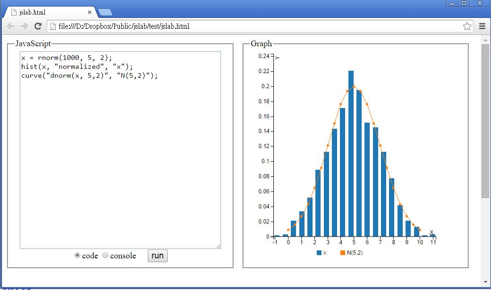

jslab
=====

JsLab -- A JavaScript Scientific Computing Environment (in R style API)

JsLab is a R like environment but in JavaScript Language.

We create JsLab by integrate the following open source project.

* numeric.js -- http://numericjs.com/ (BSD like license)
* jStat.js -- https://github.com/jstat/jstat (MIT license)
* d3.js -- http://d3js.org/ (BSD license)
* c3.js -- http://c3js.org/ (MIT license)

The R.js should be included to write the R style code in Javascript.

You may run the R.js in node.js console mode or in browser. 

The function of jslab is attach to the global object (in browser, the window object) so that you don't have to call api in the R.norm(x, 5, 2) style. You may just use norm(x, 5, 2) directly.

### Example 1 : run in node.js

file: rtest1.js

```javascript
var R = require("../js/R");

var x = rnorm(25, 5, 2);
C.log("x=%s\nmean(x)=%d sd(x)=%d", toStr(x,2), mean(x), sd(x,1));

var t = ttest(5.2, x, 2);
C.log("t=%j", t);
```

run the code in node.js

```
D:\Dropbox\Public\jslab\test>node rtest1
x=[5.11,5.58,6.55,8.60,5.74,5.76,6.25,4.49,2.49,5.64,3.27,5.11,5.27,5.48,4.13,3.
44,4.51,2.95,6.80,5.95,6.06,8.40,4.24,4.74,3.03]
mean(x)=5.1825993345749195 sd(x)=1.5376908648028214
t=0.9553477856606291
```

### Example 2 : run in browser.js



file : jslab.html

```html
<html>
  <head>
    <link rel="stylesheet" type="text/css" href="../css/c3.css">
	<style>
	body, fieldset, div { font-size:large; }
	button { font-size:large; }
	div { float:left; width:90%; height:90%; border:#dddddd 0px dotted;}
	textarea { width:95%; border:#336699 1px dotted; font-size:16px; }
	fieldset { width:90%; height:98%; }
	</style>
  </head>
  <body>
   <div style="width:100%; height:500px;">
    <div style="width:50%;height:95%">
     <fieldset>
      <legend>JavaScript</legend>
	  <center>
	  <textarea id="code" style="height:90%" onkeyup="codekeyup(event)">
x = rnorm(1000, 5, 2);
hist(x, "normalized", "x");
curve("dnorm(x, 5,2)", "N(5,2)");
</textarea><br/>
	  <input type="radio" name="mode" value="code" checked="true"/>code
      <input type="radio" name="mode" value="console"/>console &nbsp;&nbsp;&nbsp;
      <button onclick="run()">run</button>
	  </center>
    </div>
    <div style="width:50%;height:95%">
     <fieldset>
      <legend>Graph</legend>
      <div id="chart" style="height:95%"></div>
     </fieldset>
	</div>
   </div>
   <div style="width:95%;height:300px">
   </div>
    
   <script src="../js/d3.min.js" charset="utf-8"></script>
   <script src="../js/c3.min.js"></script>
   <script src="../js/jstat.min.js"></script>
   <script src="../js/numeric.min.js"></script>
   <script src="../js/R.js"></script>
   <script>
	function codekeyup(event) {
      if (event.keyCode == 13) {
	    var codebox = document.getElementById("code");
		var lines = codebox.value.trim().split("\n");
		var lastLine  = lines.pop().trim();
		if (lastLine.substring(0,2) !== "//") {
		  var result = eval(lastLine);
		  C.log("lastLine="+lastLine+" result="+result);
		  if (lastLine.indexOf("=")<0 && typeof(result)!=="undefined")
 	        codebox.value = codebox.value+"// "+result+"\n";
		}
		codebox.scrollTop = codebox.scrollHeight;
	  } else {
        return true;
      }
	}

    function run() {
      var code = document.getElementById("code").value.replace(/\$/g, "");
      eval(code);
    }

	run();
   </script>
 </body>
</html>
```


